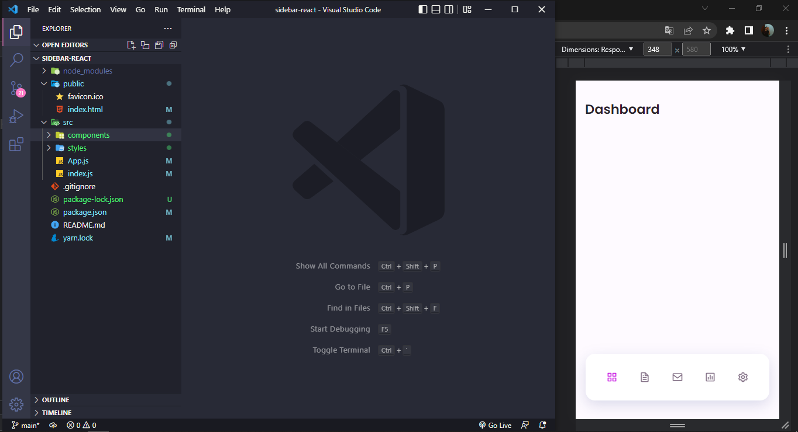
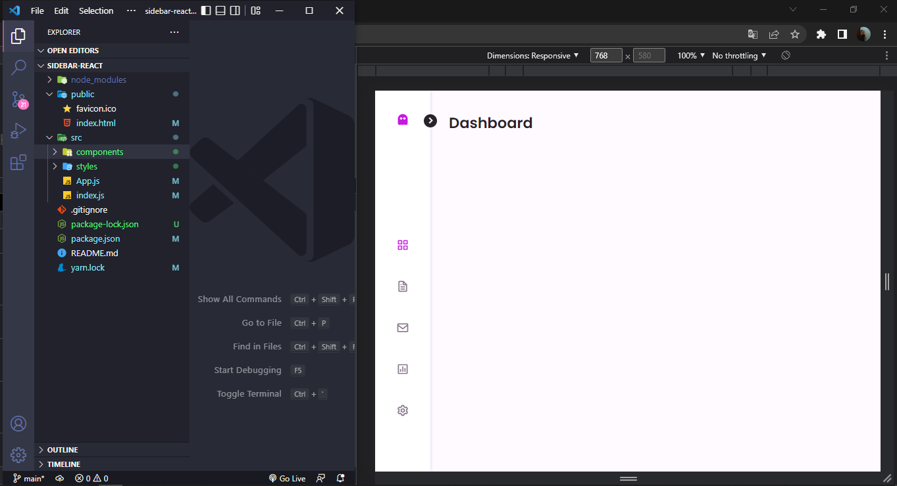

# Sidebar Responsiva com barra de guias

- Sidebar Responsiva com barra de guias usando ReactJS.
- Desenvolvido primeiro com a metodologia Mobile First, depois para desktop.
- Compátivel com todos os dispositivos móveis e com uma interface agrádavel para o usuário.

<div align="center">
  <sub>desenvolvido com ❤︎ pelo
    <a href="https://github.com/hrcules">Hércules Filho</a>
  </sub>
</div>

##




## 🚀 Como executar o projeto

💡 Antes de começar, você vai precisar ter instalado em sua máquina as seguintes ferramentas: [GIT](https://git-scm.com), [Yarn](https://yarnpkg.com/). Além disso é bom ter um editor para trabalhar com o código como [VSCode](https://code.visualstudio.com/)

### 🎲 Rodando a aplicação

```bash
# Clone este repositório
$ git clone https://github.com/hrcules/responsive-sidebar

# Acesse a pasta do projeto no terminal/cmd
$ cd responsive-sidebar

# Instale as dependências
$ yarn

# Execute a aplicação em modo de desenvolvimento
$ yarn start

# O servidor inciará na porta:3000 - acesse http://localhost:3000
```

## 📝 Licença

Este projeto esta sobe a licença MIT.


